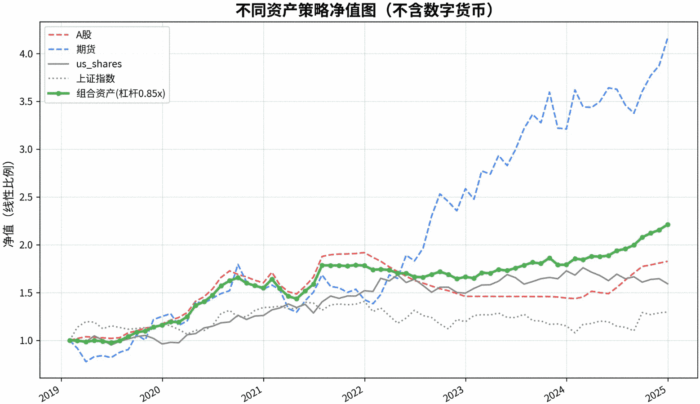

# 😸 The Compound Hacker

- 100 Billion transaction volume validated
- Global asset modeling since 2010
- Cover all trading cycles from 1 mili-second year to 1 year
- Build for long-term compounding

# 🌱 Excellence  = Skill * Breadth * Implementation

- Millions of lines of code cultivates deep algorithmic knowledge
- Disciplined scaling follows a battle-hardened methodology 
- Strike fast.  Speed is your weapon. 


# 💞️ Team
- Wall Street and Silicon Valley dual-gene
- 15 years of global investment experience
- Flat hierarchy where the best ideas win
- Regular hackathons and innovative learning 
```
     </>
    ─────  Diversity. Passionate. With taste.
     CODE
```

# 👀 Vision
From global 20 offices, achieve 20% absolute return, for 20 years


# 📈 Track Record

###  6 times in 6 years with multi assets， profitable in all assets





### The above performance are empowered by our proprietary platform:
- Unified investment methodology: **Multi-cycle nesting** + **Multi-asset rotation**
- Unified industrial process: covering **28 core procedures**, ensuring **end-to-end model deployment** from conception to production


| Asset Class | Total Return | High-freq | Short-term | Mid-term | Long-term | Key Characteristics | Sharpe Ratio |
|------------|--------------|-----------|------------|-----------|------------|-------------------|--------------|
| A-shares | 82.69% | - | ✅ | ✅ | ✅ | Outperforming SSE (4.5% ann.) | 0.93 |
| Futures| 316% | ✅ | ✅ | - | - | Stable in volatile markets | 1.01 |
| US Stocks | 59.15% | - | - | ✅ | ✅ | Global market exposure | 0.66 |
| Crypto | 1959% | ✅ | ✅ | ✅ | ✅ | High volatility opportunities | 0.97 |
| Portfolio | 602.27% | ✅ | ✅ | ✅ | ✅ | Multi-asset diversification | 0.97 |


# 🔍 We're Expanding

We're always looking for exceptional talent in:
- Quantitative Scientist
- Mathematical/AI Modeling
- Low-Latency data Systems
- DevOps and Infrastructure


```text
     .                        /\_/\       __
     .  °　    　　•　　  _____( >O< ) <  "I'M IN!!! HACK MODE!!! WOOHOO!!!"
     .  　★   　*   ====(x         <    /____\
     ★　   *      °    |          |==(:)  o  |
     . .　　✯　•　°    .  \_________/    | BEER |
     ☆    .   ☄   .       VV     V      \_/-\_/
     .
```