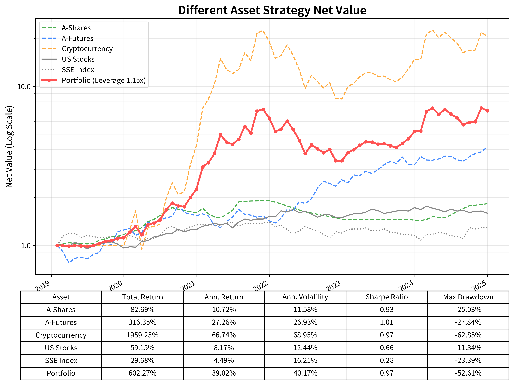

# "The Compound Hacker"
- 0.000001 second to 1 year; covers all trading cycles
- 6 major asset : each of them profitable -  US stocks, A Shares, Bond, futures, Cryptos, options
- 100 Billion; transaction volume validated since 2010
- 600% in 6 years; Compound Hacker generates compound returns: 

# Propriatary System
- **10 Millions** of lines of code cultivates deep algorithmic knowledge
- **28 core modules**, ensuring model deployment from conception to production
- **Nanosecond** event driven.  Speed is your weapon. 

[image: currently the ice mountain too finance; need compound hacker]

# Team
- Innovative Gene: 
    - Academics from Standford, Cambridge with 15 years of global investment experience
- Diversity: 
    - Scientists and philosophers from Biology, Computing, Drama, Oil drilling and military defense 
- Learning: 
    - Regular hackathons and innovative learning 
- Collabration: 
    - Flat hierarchy where the best ideas win everyone's support
(Join Us: link to the hiring page)

# Mission
- Through open source, make the fiancial market reach "Weak Form Market Efficiency"

# Vision
### 20 globaloffices, 20% annual return, 20 years
- Asia: Beijing, Shanghai, Hong Kong, Singapore, Tokyo
- America: New York, Palo Alto, 
- Europe: London, Frankfurt, Sydney, 
- Emerging Market: Dubai, Mumbai, Ho Chi Ming, Rwanda and Etc.
[每个地区一个方格]

# Values
"Excellence  = Skill * Breadth * Implementation"

[image]: we need a picture to explain this:
- Skill is the alpha
- Breadth is about how frequently in how many assets you can apply your skill
- Implementation is about the ability to transfer your skill to the real market

# Track Record

###  6 times in 6 years with multi assets, profitable in all assets

### Return = Assets ^ (Trading Cycles)
| Asset Class | Total Rtn | High-freq | Short-term | Mid-term | Long-term |
|------------|--------------|-----------|------------|-----------|-----------|
| A-shares | 82.69% | - | ✅ | ✅ | ✅ |
| Futures| 316% | ✅ | ✅ | - | - |
| US Stocks | 59.15% | - | - | ✅ | ✅ |
| Crypto | 1959% | ✅ | ✅ | ✅ | ✅ |
| Portfolio | 602.27% | ✅ | ✅ | ✅ | ✅ |

# Join Us

We're always looking for exceptional talent in:
- Quantitative Scientist
- Mathematical/AI Modeling
- Low-Latency data Systems
- DevOps and Infrastructure

